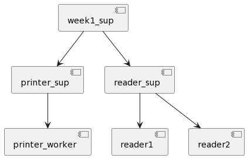
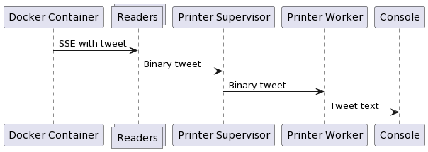
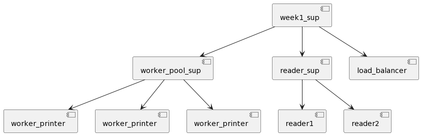
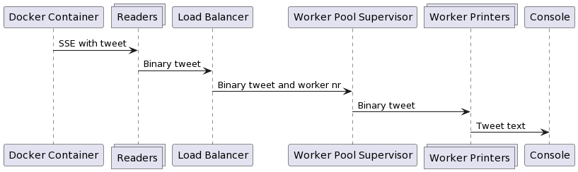
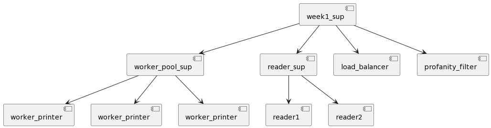
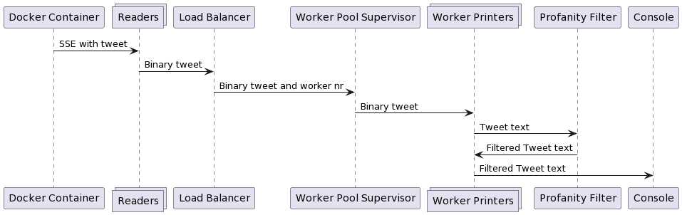
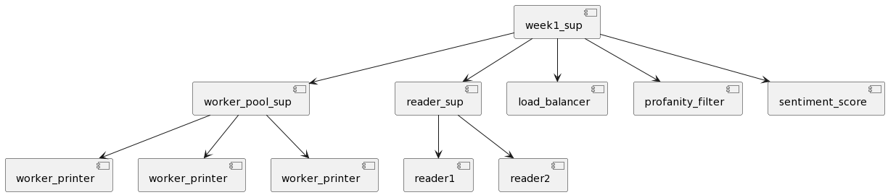
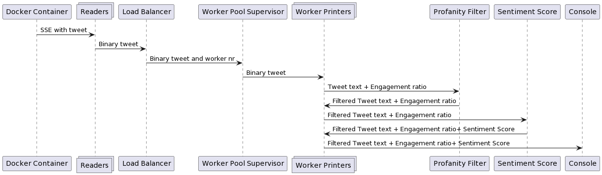
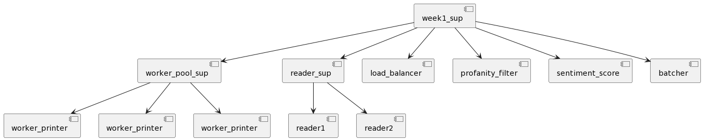
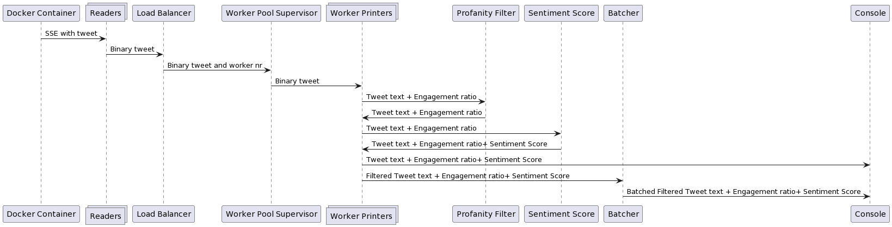

# FAF.PTR16.1 -- Project 1

> **Performed by:** Viorel Noroc, group FAF-203

> **Verified by:** asist. univ. Alexandru Osadcenco

## General Requirements

Compared to the previous Project, all weeks for this one aim to build upon the same application.

The goal is to finish the Project with a more or less functional stream processing system.

Since you will be working on a complex application, each presentation will now require
you to present 2 diagrams: a Message Flow Diagram and a Supervision Tree Diagram. The
Message Flow Diagram describes the message exchange between actors of your system whereas
the Supervision Tree Diagram analyzes the monitor structures of your application.

Every task you work on should be easily verifiable. Your system should provide logs about
starting / stopping actors, auto-scaling / load balancing workers and printing processed tweets
on screen.

## Week 1

Supervision Tree Diagram:



Message Flow Diagram:



### Task 1 -- **Minimal Task**

Initialize a VCS repository for your project.

[https://github.com/darkcat013/ptr-lab2](https://github.com/darkcat013/ptr-lab2)

### Task 2 -- **Minimal Task**

Write an actor that would read SSE streams. The SSE streams for this lab are available on [Docker Hub](https://hub.docker.com/) at `alexburlacu/rtp-server`, courtesy of our beloved FAFer Alex Burlacu.

```erlang
-module(reader).

-export([start/1]).

start(Endpoint) ->
    {Pid, _} = spawn_monitor(fun() -> read_sse(Endpoint) end),
    {ok, Pid}.

read_sse(Endpoint) ->
    {ok, Conn} = shotgun:open("localhost", 8080),
    Options =
        #{async => true,
          async_mode => sse,
          handle_event =>
              fun(_, _State, BinMsg) -> printer_sup:send_msg(BinMsg) end},
    {ok, _Ref} = shotgun:get(Conn, Endpoint, #{}, Options).
```

This is a simple actor that opens a connection to localhost:8080 using the Shotgun library and reads the Server Side Events. When an event is received, it is sent to the printer supervisor.

### Task 3 -- **Minimal Task**

Create an actor that would print on the screen the tweets it receives from
the SSE Reader. You can only print the text of the tweet to save on screen space.

```erlang
-module(printer).

-export([start/0]).

start() ->
    {Pid, _} = spawn_monitor(fun() -> receive_loop() end),
    {ok, Pid}.

receive_loop() ->
    receive
        Message when <<"event: \"message\"">> /= Message ->
            [_ | [Json]] = string:split(Message, ": "),
            TweetMap = jsx:decode(Json),
            #{<<"message">> := #{<<"tweet">> := #{<<"text">> := TweetText}}} = TweetMap,
            io:format("~s~n", [binary_to_list(TweetText)]),
            timer:sleep(rand:uniform(45)+5)
    end,
    receive_loop().
```

This is a simple actor that decodes a json using the JSX library and prints the tweet text.

### Task 4 -- **Main Task**

Create a second Reader actor that will consume the second stream provided by
the Docker image. Send the tweets to the same Printer actor.

```erlang
-module(reader_sup).

-behaviour(supervisor).

-export([start_link/0]).
-export([init/1]).

-define(SERVER, ?MODULE).

start_link() ->
    supervisor:start_link({local, ?SERVER}, ?MODULE, []).

init([]) ->
    MaxRestarts = 1000,
    MaxTime = 10,
    SupFlags =
        #{strategy => one_for_one,
          intensity => MaxRestarts,
          period => MaxTime},

    Endpoint1 = "/tweets/1",
    Endpoint2 = "/tweets/2",

    Reader1 =
        #{id => reader1,
          start => {reader, start, [Endpoint1]},
          restart => permanent,
          shutdown => 2000,
          type => worker,
          modules => [reader]},

    Reader2 =
        #{id => reader2,
          start => {reader, start, [Endpoint2]},
          restart => permanent,
          shutdown => 2000,
          type => worker,
          modules => [reader]},

    ChildSpecs = [Reader1, Reader2],
    {ok, {SupFlags, ChildSpecs}}.
```

This reader supervisor starts 2 reader actors with 2 different endpoints, they both send the message to the printer supervisor which has only 1 child.

### Task 5 -- **Main Task**

Continue your Printer actor. Simulate some load on the actor by sleeping every
time a tweet is received.
Suggested time of sleep – 5ms to 50ms.
Consider using Poisson
distribution. Sleep values / distribution parameters need to be parameterizable.

```erlang
timer:sleep(rand:uniform(45)+5)
```

I simulated the load by using a random time for sleep from 5 to 50 ms.

## Week 2

Supervision Tree Diagram:



Message Flow Diagram:



### Task 1 -- **Minimal Task**

Create a Worker Pool to substitute the Printer actor from previous week. The
pool will contain 3 copies of the Printer actor which will be supervised by a Pool Supervisor.
Use the one-for-one restart policy.

```erlang
-module(worker_pool_sup).

-behaviour(supervisor).

-export([start_link/1, send_msg/2]).
-export([init/1]).

-define(SERVER, ?MODULE).

start_link(WorkersNr) ->
    {ok, Pid} = supervisor:start_link({local, ?SERVER}, ?MODULE, []),
    start_workers(WorkersNr),
    {ok, Pid}.

init([]) ->
    MaxRestarts = 1000,
    MaxTime = 10,
    SupFlags =
        #{strategy => simple_one_for_one,
          intensity => MaxRestarts,
          period => MaxTime},

    ChildSpecs =
        [#{id => worker_printer,
           start => {worker_printer, start, []},
           restart => permanent,
           shutdown => 2000,
           type => worker,
           modules => [worker_printer]}],
    {ok, {SupFlags, ChildSpecs}}.

send_msg(BinMsg, WorkerNr) ->
    {_, ChildPid, _, _} = lists:nth(WorkerNr, supervisor:which_children(?MODULE)),
    ChildPid ! BinMsg.

new_child() ->
    supervisor:start_child(?MODULE, []).

start_workers(0) -> ok;
start_workers(WorkersNr) ->
    new_child(),
    start_workers(WorkersNr-1).

```

The printer_sup from previous week was renamed in worker_pool_sup and it starts 3 printer workers.

### Task 2 -- **Minimal Task**

Create an actor that would mediate the tasks being sent to the Worker Pool.
Any tweet that this actor receives will be sent to the Worker Pool in a Round Robin fashion.
Direct the Reader actor to sent it’s tweets to this actor.

```erlang
-module(load_balancer).

-export([start/1]).

start(WorkersNr) ->
    Pid = spawn_link(fun() -> balancer_loop(WorkersNr, 1) end),
    register(balancer, Pid),
    {ok, Pid}.

%% round robin
balancer_loop(WorkersNr, CurrentNr) ->
    receive
        BinMsg ->
            worker_pool_sup:send_msg(BinMsg, CurrentNr)
    end,
    balancer_loop(WorkersNr, CurrentNr rem 3 + 1).

```

This is a simple round robin balancer which is registered and both readers sent their messages to it.

### Task 3 -- **Main Task**

Continue your Worker actor. Occasionally, the SSE events will contain a “kill
message”. Change the actor to crash when such a message is received. Of course, this should
trigger the supervisor to restart the crashed actor.

```erlang
-module(worker_printer).

-export([start/0]).

start() ->
    Pid = spawn_link(fun() -> receive_loop() end),
    {ok, Pid}.

receive_loop() ->
    receive
        Message when <<"event: \"message\"">> /= Message ->
            case string:find(Message, "panic") of
                nomatch ->
                    [_, Json] = string:split(Message, ": "),
                    TweetMap = jsx:decode(Json),
                    #{<<"message">> := #{<<"tweet">> := #{<<"text">> := TweetText}}} = TweetMap,
                    io:format("Worker: ~p, Text: ~s~n", [self(), binary_to_list(TweetText)]),
                    timer:sleep(rand:uniform(45) + 5),
                    receive_loop();
                _ ->
                    io:format("Worker: ~p, Kill message received (panic) ~n", [self()])
            end
    end.
```

The kill message is panic and the worker stops when receives it. The supervisor restarts the worker after this.

## Week 3

Supervision Tree Diagram:



Message Flow Diagram:



### Task 1 -- **Minimal Task**

Continue your Worker actor. Any bad words that a tweet might contain
mustn’t be printed. Instead, a set of stars should appear, the number of which corresponds to
the bad word’s length. Consult the Internet for a list of bad words.

```erlang
-module(profanity_filter).

-export([start/0]).

start() ->
    BadWordsMap = init_badwords_map(),
    Pid = spawn_link(fun() -> loop(BadWordsMap) end),
    register(filter, Pid),
    {ok, Pid}.

loop(BadWordsMap) ->
    receive
        {TweetText, CallerPid} ->
            FilteredText = match_words(BadWordsMap, TweetText),
            CallerPid ! {filtered, FilteredText}
    end,
    loop(BadWordsMap).

init_badwords_map() ->
    {ok, Binary} = file:read_file("badwords.txt"),
    init_badwords_map(#{}, string:split(Binary, "\r\n", all)).

init_badwords_map(Map, []) ->
    Map;
init_badwords_map(Map, WordList) ->
    [Word | NewList] = WordList,
    init_badwords_map(maps:put(Word, get_asterisks(Word), Map), NewList).

get_asterisks(Word) ->
    get_asterisks(byte_size(Word), "").

get_asterisks(0, Acc) ->
    Acc;
get_asterisks(WordLength, Acc) ->
    get_asterisks(WordLength - 1, "*" ++ Acc).

match_words(Dictionary, OriginalString) when is_map(Dictionary) ->
    SplitString = string:split(binary_to_list(OriginalString), " ", all),
    ResultString =
        lists:map(fun(Word) ->
                     case maps:is_key(list_to_binary(Word), Dictionary) of
                         true -> maps:get(list_to_binary(Word), Dictionary);
                         false -> Word
                     end
                  end,
                  SplitString),
    list_to_binary(string:join(ResultString, " ")).
```

To filter the words, I made an actor that initializes a map of badwords from a txt file named badwords.txt and all the printers send their text to this actor to filter their messages.
## Week 4

Supervision Tree Diagram:



Message Flow Diagram:



### Task 1 -- **Minimal Task**

Continue your Worker actor. Besides printing out the redacted tweet text,
the Worker actor must also calculate two values: the Sentiment Score and the Engagement
Ratio of the tweet. To compute the Sentiment Score per tweet you should calculate the mean
of emotional scores of each word in the tweet text. A map that links words with their scores is
provided as an endpoint in the Docker container. If a word cannot be found in the map, it’s
emotional score is equal to 0. The Engagement Ratio should be calculated as follows:

$$
engagement\_ratio = \frac{ favourites + retweets }{ followers}
$$

```erlang
-module(sentiment_score).

-export([start/0]).

loop(MapOfEmotions) ->
  receive
    {Params, CallerPid} ->
      {FilteredText, EngagementScore} = Params,
      TweetWords = string:split(binary_to_list(FilteredText), " ", all),
      Scores =
        lists:map(fun(Word) when is_integer(Word) =:= false ->
                     LowerWord = string:to_lower(Word),
                     get_score(LowerWord, MapOfEmotions)
                  end,
                  TweetWords),
      SentimentScore = lists:sum(Scores) / length(Scores),
      CallerPid ! {sentiment_calculated, {FilteredText, EngagementScore, SentimentScore}},
      loop(MapOfEmotions)
  end.

-module(worker_printer).

-export([start/0]).

start() ->
    Pid = spawn_link(fun() -> receive_loop() end),
    {ok, Pid}.

receive_loop() ->
    receive
        {sentiment_calculated, Params} -> 
            {FilteredText, EngagementScore, SentimentScore} = Params,
            io:format("Worker: ~p; Sentiment Score: ~p; Engagement Score: ~p; Text: ~s~n", [self(), SentimentScore, EngagementScore, binary_to_list(FilteredText)]),
            timer:sleep(rand:uniform(45) + 5),
            receive_loop();
        {filtered, Params} ->
            sentiment ! {Params, self()},
            receive_loop();
        Message when Message /= <<"event: \"message\"">> ->
            case string:find(Message, "panic") of
                nomatch ->
                    [_, Json] = string:split(Message, ": "),
                    TweetMap = jsx:decode(Json),
                    #{<<"message">> := #{<<"tweet">> := #{<<"text">> := TweetText}}} = TweetMap,
                    #{<<"message">> := #{<<"tweet">> := #{<<"favorite_count">> := Favorites}}} = TweetMap,
                    #{<<"message">> := #{<<"tweet">> := #{<<"retweet_count">> := Retweets}}} = TweetMap,
                    #{<<"message">> := #{<<"tweet">> := #{<<"user">> := #{<<"followers_count">> := Followers}}}} = TweetMap,
                    EngagementScore = (Favorites + Retweets)/Followers,
                    filter ! {TweetText, EngagementScore, self()},
                    receive_loop();
                _ ->
                    io:format("Worker: ~p, Kill message received (panic) ~n", [self()])
            end
    end.
```

Engagement score is calculated inside the worker printer and the sentiment score is calculated in a separate actor that has the map of the emotion score for each word and all of this is printed in console.

## Week 5

Supervision Tree Diagram:



Message Flow Diagram:



### Task 1 -- **Minimal Task**

Create an actor that would collect the redacted tweets from Workers and
would print them in batches. Instead of printing the tweets, the Worker should now send them
to the Batcher, which then prints them. The batch size should be parametrizable.

```erlang
-module(batcher).

-export([start/1]).

start(BatchSize) ->
  Pid = spawn_link(fun() -> loop(BatchSize, []) end),
  register(batcher, Pid),
  {ok, Pid}.

loop(BatchSize, Batch) ->
  case length(Batch) == BatchSize of
    true ->
      print_tweets(lists:reverse(Batch)),
      loop(BatchSize, []);
    false ->
      receive
        {batch, Params} ->
          NewBatch = [Params | Batch],
          loop(BatchSize, NewBatch)
      end
  end.

print_tweets([]) ->
  ok;
print_tweets(Batch) ->
  [Params | NewBatch] = Batch,
  {FilteredText, EngagementRatio, IsRedacted, SentimentScore} = Params,
  io:format("BATCH Worker: ~p; Sentiment Score: ~p; Engagement Ratio: ~p; Filtered: ~p Text: "
                    "~s~n",
                    [self(), SentimentScore, EngagementRatio, IsRedacted, binary_to_list(FilteredText)]),
  print_tweets(NewBatch).

```

If the filtered text is different than the original tweet text then it is sent to the batcher along with other params. When the batch size is 5 in this case, it will print all the tweets and reset the batch.


## Bibliography

[https://www.erlang.org/doc/design_principles/sup_princ.html](https://www.erlang.org/doc/design_principles/sup_princ.html)

[https://github.com/inaka/shotgun](https://github.com/inaka/shotgun)

[https://hexdocs.pm/shotgun/shotgun.html](https://hexdocs.pm/shotgun/shotgun.html)

[http://www.plantuml.com/](http://www.plantuml.com/)

[https://github.com/dsojevic/profanity-list/blob/main/en.txt](https://github.com/dsojevic/profanity-list/blob/main/en.txt)